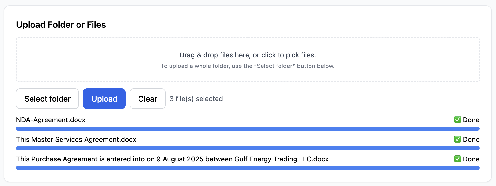
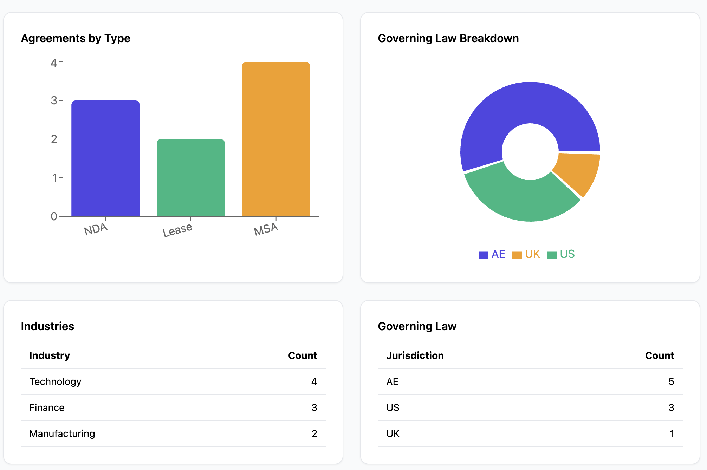
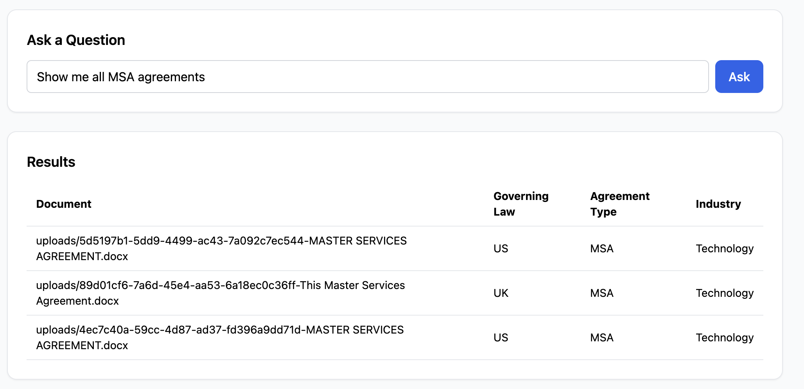

Doc Analyzer is a serverless-lean architecture leveraging S3 + DynamoDB for storage, Lambda for ingestion, and App Runner for NLP/API. It supports direct-to-S3 uploads, automatic text/NLP extraction, and robust natural-language filtering with a clean React UI. It’s stageable, scalable, and easy to operate with minimal infrastructure overhead.  
Tool is currently running on: https://d2opskdbm2go75.cloudfront.net/

# Deployment & Local Development Guide

This guide covers prerequisites, AWS stack deployment, running the frontend locally, and using the API.

---

## 1. Prerequisites

Ensure you have:

- **AWS Account** with S3, DynamoDB, Lambda, App Runner, CloudFront permissions.
- **AWS CLI v2** (`aws configure`)
- **Node.js 18+** & npm
- **Python 3.12**
- **Docker**
- **AWS CDK v2**:
  ```bash
  npm install -g aws-cdk@2
  cdk bootstrap aws://<ACCOUNT_ID>/<REGION>
  ```

---

## 2. Repo Structure

```
docapi/         # FastAPI backend
nlp_service/    # NLP extraction service
frontend/       # React + Vite frontend
cdk/            # AWS CDK stacks
source/         # Lambdas
```

---

## 3. CDK Stacks Overview

1. **CoreStack** – S3 bucket + DynamoDB table.
2. **NlpStack** – NLP service on App Runner.
3. **IngestionStack** – Lambda for ingestion pipeline.
4. **ApiStack** – FastAPI on App Runner.
5. **FrontendStack** – React app deployed to S3 + CloudFront.

---

## 4. Deployment

You can deploy all stacks, run this command from the root dir:

```bash
STAGE=dev npm run build && cdk deploy --all --context stage=$STAGE
```

Or individual stacks

```bash
# Set your stage
STAGE=dev

# Deploy stacks
cdk deploy CoreStack --context stage=$STAGE
cdk deploy NlpStack --context stage=$STAGE
cdk deploy IngestionStack --context stage=$STAGE
cdk deploy ApiStack --context stage=$STAGE  

# Build frontend.

npm --prefix frontend install && npm --prefix frontend run build

```
Create/Update `.env` with api url that you can find in AppRunner under service docstack-<stage>-docapi:  
VITE_API_BASE_URL=https://xxxxx.eu-central-1.awsapprunner.com/
Frontend url: https://d2opskdbm2go75.cloudfront.net/

```
# Deploy frontend stack
cdk deploy FrontendStack --context stage=$STAGE

```

---

## 5. Run Frontend Locally

```bash
cd frontend
npm install
echo "VITE_API_BASE_URL=https://<ApiServiceUrl>" > .env
npm run dev
```

---

## 7. Query API

```bash
curl -X POST https://<ApiServiceUrl>/query   -H "Content-Type: application/json"   -d '{"question":"Show me all MSAs in Technology industry under US law"}'
```

Example response:

```json
{
  "ok": true,
  "filters": {
    "agreement_type": "MSA",
    "industry": "Technology",
    "governing_law": "US"
  },
  "matches": [
    {
      "document_id": "12345",
      "title": "Tech MSA Contract",
      "industry": "Technology",
      "governing_law": "US"
    }
  ]
}
```

# Core Components

### Storage & Metadata

- **Amazon S3 (DocsBucket)**
  - Object store for raw uploads and extracted text artifacts (`extracted/` prefix).
  - Event source for ingestion.
- **Amazon DynamoDB (DocumentsTable)**
  - Stores a row per document: S3 key, size, timestamps, pageCount, and `metadata` map enriched by NLP.

### Ingestion & Enrichment

- **AWS Lambda (IngestionFn)**

  - Triggered by **EventBridge** on S3 `Object Created`.
  - Extracts text (PDF via `pypdf`, DOCX via `python-docx`/XML fallback).
  - Calls **NLP Service** for classification & extraction (optional if `NLP_URL` provided).
  - Writes normalized metadata back to **DynamoDB** and stores extracted text to **S3**.

- **NLP Service (App Runner)**
  - Containerized FastAPI using spaCy + sentence-transformers.
  - `/analyze` endpoint returns structured fields & confidences (e.g., `agreement_type`, `governing_law`, `industry`, `parties`).
  - Deployed via **AWS App Runner** from an **ECR** image.

### Public API & Frontend

- **API Service (App Runner, FastAPI)**

  - Endpoints:
    - `GET /health`
    - `GET /docs` (list latest docs)
    - `POST /upload/presign` (direct browser → S3)
    - `POST /query` (Mass Interrogation / NLQ filtering over DynamoDB)
    - `GET /dashboard` (Returns charts data)
  - Talks to **DynamoDB** & **S3**; calls **NLP** for interpreting NLQ.

- **Frontend (S3 + CloudFront)**
  - Vite/React static SPA.
  - Uses `VITE_API_BASE_URL` to call API directly.
  - Deployed to S3, served via CloudFront CDN.

### Scalability & Cost

- S3, DynamoDB: serverless scale; pay-per-use.
- Lambda: scales per event; cost proportional to ingestion rate & function time.
- App Runner (API & NLP): instance-based; auto-scales on load (min/max concurrency).
- CloudFront: caches static assets; low latency globally.

# Screenshots

### Upload



### Dashboard



### NLP Query


